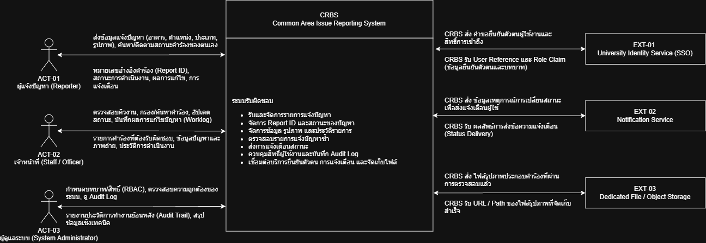

# 11 — Conceptual Architecture

> **Week 11 deliverable**

## 1. Architecture Overview

[อธิบายสั้น ๆ ว่าระบบแบ่งหน้าที่/ชั้น/องค์ประกอบอย่างไร]

## 2. System Context (C4 ระดับ 1)

System Context แสดงระบบแจ้งปัญหาพื้นที่ส่วนกลางเป็น **กล่องเดียว** ร่วมกับผู้ใช้งาน (Actors) และระบบภายนอก (External Systems) เพื่อนิยามขอบเขตสิ่งที่ระบบรับผิดชอบและไม่รับผิดชอบ

### ตาราง Actors และ External Systems

| ID | ชื่อ | บทบาท / สิ่งที่ส่งเข้าระบบ | สิ่งที่รับจากระบบ | สถานะในรุ่นแรก |
|---|---|---|---|---|
| **ACT-01** | ผู้แจ้งปัญหา (Reporter) | ส่งข้อมูลแจ้งปัญหา (อาคาร, ตำแหน่ง, ประเภท, รูปภาพ), ค้นหา/ติดตามสถานะคำร้องของตนเอง | หมายเลขอ้างอิงคำร้อง (Report ID), สถานะการดำเนินงาน, ผลการแก้ไข, การแจ้งเตือน | **Core** |
| **ACT-02** | เจ้าหน้าที่ (Staff / Officer) | ตรวจสอบคิวงาน, กรอง/ค้นหาคำร้อง, อัปเดตสถานะ, บันทึกผลการแก้ไขปัญหา (Worklog) | รายการคำร้องที่ต้องรับผิดชอบ, ข้อมูลปัญหาและภาพถ่าย, ประวัติการดำเนินงาน | **Core** |
| **ACT-03** | ผู้ดูแลระบบ (System Administrator) | กำหนดบทบาท/สิทธิ์ (RBAC), ตรวจสอบความถูกต้องของระบบ, ดู Audit Log | รายงานประวัติการทำงานย้อนหลัง (Audit Trail), สรุปข้อมูลเชิงเทคนิค | **Core** |
| **EXT-01** | University Identity Service (SSO) | ส่ง User Reference และ Role Claim (ข้อมูลยืนยันตัวตนและบทบาท) | คำขอยืนยันตัวตนผู้ใช้งานและสิทธิ์การเข้าถึง | **Core boundary** (Protocol/Format = TBD) |
| **EXT-02** | Notification Service | ส่งผลลัพธ์การส่งข้อความแจ้งเตือน (Status Delivery) | ข้อมูลเหตุการณ์การเปลี่ยนสถานะเพื่อส่งแจ้งเตือนผู้ใช้ | **Core / Extension** (In-app vs Push = TBD ตาม OD-02) |
| **EXT-03** | Dedicated File / Object Storage | ส่ง URL / Path ของไฟล์รูปภาพที่จัดเก็บสำเร็จ | ไฟล์รูปภาพประกอบคำร้องที่ผ่านการตรวจสอบแล้ว | **Core** (เกณฑ์ขนาดไฟล์ = TBD ตาม OD-01) |

## 3. Container diagram (C4 ระดับ 2)

ซูมเข้าสู่ภายในระบบเพื่อระบุ **3 Containers หลัก** ที่ต้องรันขึ้นมาทำงาน พร้อมระบุเทคโนโลยี สภาพแวดล้อม และความรับผิดชอบ:

| Container | หน้าที่และความรับผิดชอบ | ชนิดและ Stack (Proposed) | รันที่ไหน / ใครควบคุม | ข้อมูลที่จัดเก็บ | การเชื่อมต่อสื่อสาร |
|---|---|---|---|---|---|
| **Web Application** | นำเสนอหน้าจอแบบ Responsive สำหรับผู้แจ้งปัญหา, เจ้าหน้าที่, และผู้ดูแลระบบ: ฟอร์มแจ้งปัญหา, รายการติดตามสถานะ, คอนโซลจัดการคิวงานเจ้าหน้าที่ และหน้าตรวจสอบ Audit Log | เว็บแอปพลิเคชันฝั่ง Client ในเบราว์เซอร์ · **React** | รันบนเว็บเบราว์เซอร์ของผู้ใช้ — **ผู้ใช้ควบคุม** | ไม่เก็บข้อมูลถาวร (เก็บบน Memory / Client State ชั่วคราว) | เชื่อมต่อไปยัง API Application ผ่าน REST/JSON (HTTPS) |
| **API Application** | ศูนย์กลางการบังคับใช้กฎทางธุรกิจ (BR-01 ถึง BR-04), การควบคุมสิทธิ์ RBAC (D3), การออก Report ID (D1), การเปลี่ยนสถานะและบันทึก Worklog (D2), และบันทึก Audit Log | โปรแกรมฝั่งเซิร์ฟเวอร์ (Backend Service) · **Node.js + Express** | รันบน Server ของทีม — **ทีมควบคุม** | ไม่เก็บข้อมูลถาวรเอง ประสานงานผ่าน Database และ Object Storage | รับ REST/JSON จาก Web App, สื่อสารกับ Database ด้วย SQL/Transaction, สื่อสารกับ EXT-01..03 ผ่าน API/HTTP |
| **Database** | แหล่งจัดเก็บข้อมูลหลักของระบบ รองรับ ACID Transactions สำหรับคำร้อง, ข้อมูลสถานที่, ประวัติสถานะ, บันทึกผลงาน และ Audit Log | ฐานข้อมูลเชิงสัมพันธ์ (Relational Database) · **PostgreSQL** | รันบน Database Server — **ทีมควบคุม** (เข้าถึงได้เฉพาะ API) | ข้อมูลคำร้อง (DR-01), สถานที่ (DR-02), หมวดหมู่ปัญหา, สถานะ, Worklog, Audit Log | เชื่อมต่อกับ API Application ผ่าน TCP/SQL เท่านั้น |

### รูปภาพ Container Diagram (C4 Level 2)

> *(เว้นว่างสำหรับวางภาพไดอะแกรมจาก draw.io: `diagrams/architecture/container-c4-level2.png`)*  
> 

---

## 3. Components / Modules

| Component | Responsibilities | Inputs/Outputs | Related Requirements |
|---|---|---|---|
| [Component] | [กรอก] | [กรอก] | FR-xx |

## 4. Data and External Dependencies

| Dependency | Purpose | Risks / Constraints | Related Design Decision |
|---|---|---|---|
| [กรอก] | [กรอก] | [กรอก] | D-xx |

## 5. Architecture Rationale

- [เหตุผลที่เลือก architecture นี้]
- [ข้อดี/ข้อจำกัด]

## 6. Quality Attribute Evaluation Questions

- [เช่น การออกแบบนี้ช่วยให้ข้อมูลการจองไม่ซ้ำกันได้อย่างไร?]
- [เช่น ผู้ใช้บนมือถือเข้าถึงได้อย่างไร?]
