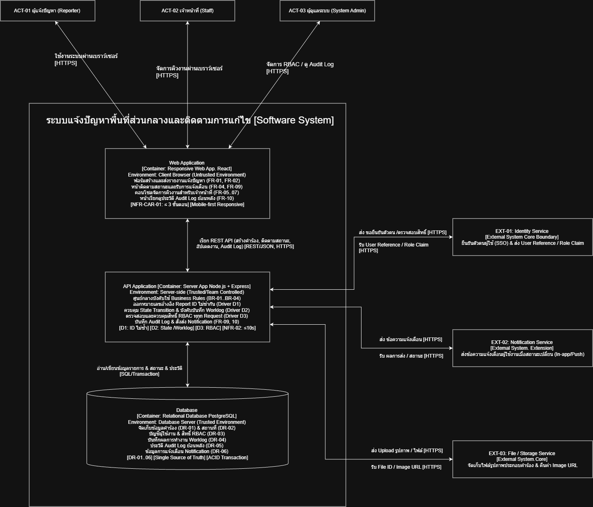

# 11 — Conceptual Architecture

> **Week 11 Deliverable**  
> **โครงการ:** ระบบแจ้งปัญหาพื้นที่ส่วนกลางและติดตามการแก้ไข (Common Area Issue Reporting)  
> **ทีม:** Group 10 | **เวอร์ชัน:** v0.1 — Design Draft | **สถานะ:** Baseline Candidate  
> **เอกสารอ้างอิง:** [07-srs-v1.md](../docs/07-srs-v1.md), [10-design-strategy.md](10-design-strategy.md)  
> **Stack อ้างอิง (Proposed):** React · Node.js + Express · PostgreSQL  

---

## ข้อมูลโครงการและสารบัญ

| หัวข้อ | รายละเอียด |
|---|---|
| **Case** | Case 10 — ระบบแจ้งปัญหาพื้นที่ส่วนกลางและติดตามการแก้ไข (ENGSE206-Cases10-common-area-issue-reporting) |
| **Team** | Group 10 |
| **สถานะเอกสาร** | v0.1 — Design Draft (W11) |
| **ฐาน SRS** | Case-10-SRS-W07-v1 — Baseline Candidate |
| **ข้อมูลนำเข้าจาก W10** | Design Strategy v1.0 + Design Spine (W10) |
| **Stack อ้างอิง** | Web: React · API: Node.js + Express · DB: PostgreSQL (Proposed) |

### สารบัญโครงสร้างเนื้อหา (11 หัวข้อ)

1. [สิ่งที่รับมาจาก W10](#1-สิ่งที่รับมาจาก-w10)
2. [System Context (C4 ระดับ 1)](#2-system-context-c4-ระดับ-1)
3. [Container diagram (C4 ระดับ 2)](#3-container-diagram-c4-ระดับ-2)
4. [ชนิดและสภาพแวดล้อมของ container](#4-ชนิดและสภาพแวดล้อมของ-container)
5. [NFR กระทบ container ไหน](#5-nfr-กระทบ-container-ไหน)
6. [Decision cards](#6-decision-cards)
7. [เดิน Spine บน container diagram](#7-เดิน-spine-บน-container-diagram)
8. [Open decisions ที่กระทบ container](#8-open-decisions-ที่กระทบ-container)
9. [ส่งต่อ W12 และ W13](#9-ส่งต่อ-w12-และ-w13)
10. [Done checklist W11](#10-done-checklist-w11)
11. [AI use และ Team worklog](#11-ai-use-และ-team-worklog)

---

## 1. สิ่งที่รับมาจาก W10

งานในสัปดาห์ที่ 11 (Conceptual Architecture) ต่อยอดโดยตรงจากผลงาน Design Strategy (W10) ของ Case 10 โดยนำ 4 องค์ประกอบสำคัญมาใช้กำหนดโครงสร้างสถาปัตยกรรม:

| สิ่งที่รับมาจาก W10 | สาระสำคัญจาก W10 ของ Case 10 | นำมาใช้ใน W11 ตรงไหน |
|---|---|---|
| **Scope (ขอบเขตการพัฒนา)** | • **Build now:** UC-01 สร้างรายงานแจ้งปัญหา (FR-01, RC-01), UC-02 ติดตามสถานะและการแจ้งเตือน (FR-02, RC-02, RC-03), UC-03 อัปเดตสถานะและบันทึกผลงาน (FR-04) • **Overview:** UC-04 ดูรายการ ค้นหา และกรองข้อมูลตามประเภท/อาคาร (FR-10) • **Later:** การส่งคำร้องได้ภายใน ≤ 3 ขั้นตอน (NFR-CAR-01) • **ไม่ทำ (Out of scope):** การเรียกดูรายงานสรุปสถิติและวิเคราะห์ภาพรวม (US-08, NFR-02) | ใช้กำหนดขอบเขตระบบใน System Context (หัวข้อ 2) และเลือก Container ที่ต้องมีในรุ่นแรก (หัวข้อ 3) |
| **Design Drivers (3 เรื่องห้ามพลาด)** | • **D1:** ต้องไม่มี ID ของรายการแจ้งซ้ำกันในระบบ — หมายเลขคำร้องต้องไม่ซ้ำ (FR-CAR-03) • **D2:** เปลี่ยนสถานะเพื่อบอกให้ผู้แจ้งทราบถึงสถานะของการแจ้ง — อัปเดตสถานะได้ (FR-CAR-04, FR-CAR-06) • **D3:** ต้องกำหนดสิทธิ์ใช้งานในระบบ — กำหนดบทบาทของแต่ละผู้ใช้ (NFR-CAR-03) | ใช้เป็นเกณฑ์ตัดสินใจว่ากฎทางธุรกิจและสิทธิ์ต้องถูกควบคุมที่ Container ใด (หัวข้อ 4–6) |
| **Design Spine (เส้นทางคำขอหนึ่งใบ)** | เส้นทางคำขอหนึ่งใบ 4 ขั้นตอนหลัก (ขั้นที่ 1, 2, 4 = Build now · ขั้นที่ 3 = Overview) | ใช้เดินทดสอบการทำงานข้ามแต่ละ Container (หัวข้อ 7) |
| **Open Decisions** | ข้อตัดสินใจที่ยังเปิดอยู่ 3 ประเด็น: • **OD-01:** รูปแบบและประเภทไฟล์รูปภาพที่อนุญาตสำหรับการแนบประกอบคำร้อง (Max file size / formats) (ISSUE-01) → สรุปเกณฑ์ขนาดไฟล์รูปภาพและนโยบายจัดเก็บ • **OD-02:** ช่องทางและรูปแบบการส่ง Notification (In-app, Push Notification) (ISSUE-02) → สอบถามผู้ใช้และทีมพัฒนาเพื่อสรุปรูปแบบข้อความและช่องทางส่ง • **OD-03:** ระยะเวลาการจัดเก็บข้อมูลประวัติย้อนหลัง (Data Retention Policy for History Log) (ISSUE-03) → กำหนดกรอบเวลาการสำรองและเก็บประวัติคำร้องย้อนหลัง | นำมาระบุ TBD และวิเคราะห์ผลกระทบต่อ Container ในหัวข้อ 8 |

> *(พื้นที่สำหรับภาพสรุปสะพานเชื่อม W10 → W11: diagrams/architecture/w11-bridge.png)*

---

## 2. System Context (C4 ระดับ 1)

System Context แสดงระบบแจ้งปัญหาพื้นที่ส่วนกลางเป็น **กล่องเดียว** ร่วมกับผู้ใช้งาน (Actors) และระบบภายนอก (External Systems) เพื่อนิยามขอบเขตสิ่งที่ระบบรับผิดชอบและไม่รับผิดชอบ

### ตาราง Actors และ External Systems

| ID | ชื่อ | บทบาท / สิ่งที่ส่งเข้าระบบ | สิ่งที่รับจากระบบ | สถานะในรุ่นแรก |
|---|---|---|---|---|
| **ACT-01** | ผู้แจ้งปัญหา (Reporter) | ส่งข้อมูลแจ้งปัญหา (อาคาร, ตำแหน่ง, ประเภท, รูปภาพ), ค้นหา/ติดตามสถานะคำร้องของตนเอง | หมายเลขอ้างอิงคำร้อง (Report ID), สถานะการดำเนินงาน, ผลการแก้ไข, การแจ้งเตือน | **Core** |
| **ACT-02** | เจ้าหน้าที่ (Staff / Officer) | ตรวจสอบคิวงาน, กรอง/ค้นหาคำร้อง, อัปเดตสถานะ, บันทึกผลการแก้ไขปัญหา (Worklog) | รายการคำร้องที่ต้องรับผิดชอบ, ข้อมูลปัญหาและภาพถ่าย, ประวัติการดำเนินงาน | **Core** |
| **ACT-03** | ผู้ดูแลระบบ (System Administrator) | กำหนดบทบาท/สิทธิ์ (RBAC), ตรวจสอบความถูกต้องของระบบ, ดู Audit Log | รายงานประวัติการทำงานย้อนหลัง (Audit Trail), สรุปข้อมูลเชิงเทคนิค | **Core** |
| **EXT-01** | University Identity Service (SSO) | ส่ง User Reference และ Role Claim (ข้อมูลยืนยันตัวตนและบทบาท) | คำขอยืนยันตัวตนผู้ใช้งานและสิทธิ์การเข้าถึง | **Core boundary** (Protocol/Format = TBD) |
| **EXT-02** | Notification Service | ส่งผลลัพธ์การส่งข้อความแจ้งเตือน (Status Delivery) | ข้อมูลเหตุการณ์การเปลี่ยนสถานะเพื่อส่งแจ้งเตือนผู้ใช้ | **Core / Extension** (In-app vs Push = TBD ตาม OD-02) |
| **EXT-03** | Dedicated File / Object Storage | ส่ง URL / Path ของไฟล์รูปภาพที่จัดเก็บสำเร็จ | ไฟล์รูปภาพประกอบคำร้องที่ผ่านการตรวจสอบแล้ว | **Core** (เกณฑ์ขนาดไฟล์ = TBD ตาม OD-01) |

### ขอบเขตความรับผิดชอบของระบบ

- **สิ่งที่ระบบรับผิดชอบ (In Scope):**
  - การรับข้อมูลแจ้งปัญหา พร้อมรูปภาพ ตำแหน่ง อาคาร และประเภทปัญหา
  - การออกหมายเลขคำร้อง (Report ID) แบบไม่ซ้ำกันตามเงื่อนไข D1
  - การจัดการสถานะคำร้องตามวงจรชีวิต (`Open` → `In Progress` → `Resolved`) ตาม D2
  - การบันทึกผลการปฏิบัติงานของเจ้าหน้าที่ (Worklog) ก่อนการปิดงาน
  - การตรวจสอบและควบคุมสิทธิ์ตามบทบาท (RBAC) ของผู้ใช้ทุกกลุ่มตาม D3
  - การบันทึกประวัติการเปลี่ยนแปลงสถานะและ Audit Log แบบ Append-only
  - การส่งสัญญาณแจ้งเตือนเมื่อสถานะมีการเปลี่ยนแปลง

- **สิ่งที่ไม่รับผิดชอบ (Out of Scope):**
  - การจัดซื้อจัดจ้างวัสดุอุปกรณ์หรืออะไหล่สำหรับงานซ่อมบำรุง
  - การบริหารจัดการช่างภายนอกและการเบิกจ่ายงบประมาณ
  - ระบบแชตสนทนาสด (Live Chat) ระหว่างผู้แจ้งและเจ้าหน้าที่
  - การวิเคราะห์สถิติภาพรวมและการวางแผนปรับปรุงพื้นที่ส่วนกลางระดับนโยบาย (US-08)
  - การเก็บรักษาและบริหารจัดการรหัสผ่านผู้ใช้งานโดยตรง (มอบให้ EXT-01 ดูแล)

### รูปภาพ System Context Diagram (C4 Level 1)

> *(เว้นว่างสำหรับวางภาพไดอะแกรมจาก draw.io: `diagrams/architecture/context-c4-level1.png`)*  
> 

---

## 3. Container diagram (C4 ระดับ 2)

ซูมเข้าสู่ภายในระบบเพื่อระบุ **3 Containers หลัก** ที่ต้องรันขึ้นมาทำงาน พร้อมระบุเทคโนโลยี สภาพแวดล้อม และความรับผิดชอบ:

| Container | หน้าที่และความรับผิดชอบ | ชนิดและ Stack (Proposed) | รันที่ไหน / ใครควบคุม | ข้อมูลที่จัดเก็บ | การเชื่อมต่อสื่อสาร |
|---|---|---|---|---|---|
| **Web Application** | นำเสนอหน้าจอแบบ Responsive สำหรับผู้แจ้งปัญหา, เจ้าหน้าที่, และผู้ดูแลระบบ: ฟอร์มแจ้งปัญหา, รายการติดตามสถานะ, คอนโซลจัดการคิวงานเจ้าหน้าที่ และหน้าตรวจสอบ Audit Log | เว็บแอปพลิเคชันฝั่ง Client ในเบราว์เซอร์ · **React** | รันบนเว็บเบราว์เซอร์ของผู้ใช้ — **ผู้ใช้ควบคุม** | ไม่เก็บข้อมูลถาวร (เก็บบน Memory / Client State ชั่วคราว) | เชื่อมต่อไปยัง API Application ผ่าน REST/JSON (HTTPS) |
| **API Application** | ศูนย์กลางการบังคับใช้กฎทางธุรกิจ (BR-01 ถึง BR-04), การควบคุมสิทธิ์ RBAC (D3), การออก Report ID (D1), การเปลี่ยนสถานะและบันทึก Worklog (D2), และบันทึก Audit Log | โปรแกรมฝั่งเซิร์ฟเวอร์ (Backend Service) · **Node.js + Express** | รันบน Server ของทีม — **ทีมควบคุม** | ไม่เก็บข้อมูลถาวรเอง ประสานงานผ่าน Database และ Object Storage | รับ REST/JSON จาก Web App, สื่อสารกับ Database ด้วย SQL/Transaction, สื่อสารกับ EXT-01..03 ผ่าน API/HTTP |
| **Database** | แหล่งจัดเก็บข้อมูลหลักของระบบ รองรับ ACID Transactions สำหรับคำร้อง, ข้อมูลสถานที่, ประวัติสถานะ, บันทึกผลงาน และ Audit Log | ฐานข้อมูลเชิงสัมพันธ์ (Relational Database) · **PostgreSQL** | รันบน Database Server — **ทีมควบคุม** (เข้าถึงได้เฉพาะ API) | ข้อมูลคำร้อง (DR-01), สถานที่ (DR-02), หมวดหมู่ปัญหา, สถานะ, Worklog, Audit Log | เชื่อมต่อกับ API Application ผ่าน TCP/SQL เท่านั้น |

### รูปภาพ Container Diagram (C4 Level 2)

> *(เว้นว่างสำหรับวางภาพไดอะแกรมจาก draw.io: `diagrams/architecture/container-c4-level2.png`)*  
> 

---

## 4. ชนิดและสภาพแวดล้อมของ container

การแบ่งหน้าที่ตาม **สภาพแวดล้อมการทำงานและเส้นแบ่งความไว้ใจ (Trust Boundary):**

- **ฝั่งเครื่องของผู้ใช้ (Client-side / Untrusted Environment):**
  - **Web Application** รันบนเบราว์เซอร์ของผู้ใช้งาน ผู้ใช้สามารถตรวจสอบหรือแก้ไขโค้ดผ่าน Developer Tools ได้
  - *กติกาความปลอดภัย:* ห้ามเก็บกุญแจความลับ (Secrets), ห้ามตัดสินสิทธิ์ RBAC ขั้นสุดท้ายที่หน้าเว็บ, และห้ามถือว่าข้อมูลที่ส่งมาจากหน้าเว็บถูกต้องเสมอไป
- **ฝั่งเซิร์ฟเวอร์ของทีม (Server-side / Trusted Environment):**
  - **API Application & Database** รันบนเซิร์ฟเวอร์ที่มีการรักษาความปลอดภัย
  - *กติกาความปลอดภัย:* เป็นจุดเดียวที่ตัดสินสิทธิ์ (D3), รับประกันความไม่ซ้ำของ ID (D1), และควบคุมการเปลี่ยนสถานะพร้อม Audit Log (D2)

### เมนูการเลือกชนิด Container สำหรับ Case 10

| ชนิด Container | Case 10 เลือกใช้หรือไม่ | เหตุผลทางด้าน Requirement และสถาปัตยกรรม |
|---|---|---|
| **เว็บแอปพลิเคชัน (Responsive Web App)** | **เลือกใช้** | ผู้ใช้งาน (นักศึกษา/บุคลากร) ต้องการแจ้งปัญหาทันทีผ่านมือถือหรือสแกน QR Code โดยไม่ต้องดาวน์โหลดแอป รองรับ NFR-CAR-01 |
| **แอปพลิเคชันมือถือ (Native Mobile App)** | **ไม่ใช้ในรุ่นแรก** | ขอบเขตของระบบไม่มีความต้องการเข้าถึงฟังก์ชันลึกของ OS (เช่น ออฟไลน์โหมดเต็มรูปแบบ หรือเซนเซอร์พิเศษ) เพื่อลดความซ้ำซ้อนในการพัฒนา |
| **โปรแกรมฝั่งเซิร์ฟเวอร์ (API Application)** | **เลือกใช้** | จำเป็นต้องมีศูนย์กลางควบคุมกติกา BR-01–BR-04, สิทธิ์ RBAC (D3), และการออกหมายเลขคำร้อง D1 |
| **ฐานข้อมูลเชิงสัมพันธ์ (Relational Database)** | **เลือกใช้** | รองรับการทำงานแบบ ACID Transaction เพื่อป้องกัน ID ซ้ำ (D1), จัดการความสัมพันธ์ของข้อมูลคำร้องกับภาพถ่ายและประวัติงานได้อย่างแม่นยำ |
| **งานตามเวลา (Scheduled / Cron Job)** | **ไม่ใช้ในรุ่นแรก** | วงจรการทำงานของระบบขับเคลื่อนด้วยเหตุการณ์ของผู้ใช้ (Event-driven) ยังไม่มีงานที่ต้องประมวลผลอัตโนมัติตามเวลา |

---

## 5. NFR กระทบ container ไหน

การถ่ายทอด Non-Functional Requirements (NFR) จาก SRS ไปสู่การออกแบบ Container:

| NFR ID | ข้อกำหนดคุณภาพ (Requirement Statement) | ผลกระทบต่อ Container ในการออกแบบ | สถานะการออกแบบ |
|---|---|---|---|
| **NFR-CAR-01** (NFR-01) | ผู้ใช้งานสามารถสร้างและส่งรายการแจ้งปัญหาได้ภายใน ≤ 3 ขั้นตอน | **Web Application:** ออกแบบหน้าจอเป็น Single-step / Short Multi-step Form พร้อม Dropdown และ Image Preview ลดภาระการกรอกข้อมูล | ออกแบบใน W12 (UI Prototype) |
| **NFR-CAR-02** (NFR-02) | ระบบต้องตอบสนองผลลัพธ์หลักภายใน ≤ 10 วินาที (และประมวลผลทั่วไป ≤ 2–3 วินาที) | • **Web App:** บีบอัดภาพฝั่ง Client ก่อนอัปโหลด • **API App:** ประมวลผลแบบ Asynchronous ในการส่ง Notification • **Database:** ทำ Indexing บนฟิลด์ที่ใช้ค้นหาบ่อย (Status, Building, CreatedAt) | ออกแบบรับรองใน DEC-02, DEC-04 |
| **NFR-CAR-03** (NFR-03) | ระบบต้องควบคุมสิทธิ์ตามบทบาท (RBAC) และบันทึกประวัติการทำงานแบบ Append-only | • **API App:** บังคับใช้ Authorization Middleware ตรวจสิทธิ์ทุก Endpoint (D3) • **Database:** กำหนดสิทธิ์ระดับตารางและออกแบบ Audit Log ให้รองรับเฉพาะคำสั่ง `INSERT` | กำหนดใน DEC-01, DEC-02 |

---

## 6. Decision cards

บันทึกการตัดสินใจทางสถาปัตยกรรม (Architectural Decision Records - ADR แบบย่อ):

### DEC-01: กติกาทางธุรกิจและการควบคุมสิทธิ์อยู่ที่ API Application
- **สถานะ:** Proposed
- **การตัดสินใจ:** ให้ API Application เป็นจุดศูนย์กลางแห่งเดียวในการตรวจสอบสิทธิ์ RBAC (D3) และบังคับใช้กฎธุรกิจ BR-01 ถึง BR-04
- **เหตุผล (Drivers/NFR):** NFR-CAR-03, D3, หลักการ Least Privilege และเพื่อป้องกันการข้ามหน้าจอของฝั่ง Client
- **ทางเลือกที่ไม่เลือก:** ตรวจสอบสิทธิ์ที่หน้าเว็บอย่างเดียว (ไม่ปลอดภัย ผู้ใช้สามารถดัดแปลงคำขอได้)
- **ผลที่ตามมา:** หน้าเว็บทำหน้าที่เพียงซ่อน/แสดงเมนูตามบทบาทเพื่อความสะดวก แต่การอนุมัติสิทธิ์ขั้นสุดท้ายกระทำที่ API

### DEC-02: ใช้ฐานข้อมูลเชิงสัมพันธ์เดียวที่รองรับ Transaction เป็นศูนย์กลางความถูกต้อง
- **สถานะ:** Proposed
- **การตัดสินใจ:** รวมการจัดเก็บข้อมูลหลัก (คำร้อง, สถานที่, ประวัติสถานะ, Audit Log) ไว้ใน Relational Database เดียวกัน และใช้ Database Transaction ในกระบวนการเปลี่ยนสถานะ
- **เหตุผล (Drivers/NFR):** D1 (Report ID ต้องไม่ซ้ำ), D2 (การเปลี่ยนสถานะต้องสมบูรณ์), BR-03 (ต้องบันทึกผลงานก่อนปิดงาน)
- **ทางเลือกที่ไม่เลือก:** แยกฐานข้อมูลตามหน้าที่ (Micro-databases) ซึ่งเพิ่มภาระในการควบคุมความสอดคล้องของข้อมูล
- **ผลที่ตามมา:** รองรับ ACID ได้ง่าย และรับประกันความถูกต้องของวงจรสถานะคำร้อง

### DEC-03: สถาปัตยกรรม Responsive Web Application หน้าจอเดียวแบ่งตามบทบาท
- **สถานะ:** Proposed
- **การตัดสินใจ:** พัฒนา Web Application เดียวแบบ Responsive Web ที่ปรับการแสดงผลและเมนูตามสิทธิ์ของผู้ใช้ (Reporter, Staff, Admin)
- **เหตุผล (Drivers/NFR):** NFR-CAR-01, สะดวกต่อการเข้าถึงผ่านสมาร์ตโฟนด้วยการสแกน QR Code หรือผ่านเบราว์เซอร์
- **ทางเลือกที่ไม่เลือก:** พัฒนา Native Mobile App แยก iOS/Android (เพิ่มต้นทุนและระยะเวลาพัฒนาโดยไม่จำเป็น)
- **ผลที่ตามมา:** ลดความซ้ำซ้อนในการพัฒนา โดย W12 จะเน้นออกแบบ UI/UX บนเบราว์เซอร์มือถือเป็นหลัก

### DEC-04: เทคโนโลยี Stack อ้างอิง (React · Node.js + Express · PostgreSQL)
- **สถานะ:** Proposed
- **การตัดสินใจ:** เลือกใช้ชุดเทคโนโลยีมาตรฐาน: Web = React, API = Node.js + Express, DB = PostgreSQL
- **เหตุผล (Drivers/NFR):** สอดคล้องกับความต้องการของระบบ ทีมมีความคุ้นเคย และรองรับการจัดการ Transaction ได้อย่างมีเสถียรภาพ
- **ทางเลือกที่ไม่เลือก:** สถาปัตยกรรม Microservices หรือภาษาอื่นที่ทีมไม่มีความเชี่ยวชาญ
- **ผลที่ตามมา:** เป็นกรอบการทำงานตั้งต้นสำหรับพัฒนา Prototype ใน W12 และส่งต่อให้ทีมพัฒนาตรวจสอบต่อไป

> *(เว้นว่างสำหรับวางภาพไดอะแกรมทำไมที่อยู่ของกติกาสำคัญ D1/D2: `diagrams/architecture/d1-d2-rule-placement.png`)*  
> 

---

## 7. เดิน Spine บน container diagram

การทดสอบเส้นทางคำขอหนึ่งใบ (Design Spine) ทั้ง 4 ขั้นตอนผ่านแต่ละ Container:

| ขั้นที่ | กิจกรรมในเส้นทางคำขอ (Design Spine) | Use Case & Requirement | ระดับใน W10 | การเดินผ่าน Container (W11 Walkthrough) |
|---|---|---|---|---|
| **1** | ส่งรายงานแจ้งปัญหาพร้อมแนบรูปภาพ ระบุอาคาร ตำแหน่ง และประเภทปัญหา | UC-01, FR-01, FR-02 | **Build now** | **Web App** (กรอกข้อมูล/เลือกภาพ) → **API App** (ตรวจความครบ BR-01, ออก Report ID แบบไม่ซ้ำตาม D1, ส่งรูปเก็บ EXT-03) → **Database** (บันทึกคำร้องสถานะ `Open`) |
| **2** | ติดตามสถานะการดำเนินงานและการรับการแจ้งเตือนเมื่อสถานะเปลี่ยน | UC-02, FR-02, FR-09 | **Build now** | **Web App** (ผู้ใช้เปิดดูสถานะ) → **API App** (ดึงข้อมูลเฉพาะคำร้องของผู้ใช้ตาม D3) → **Database** (อ่านข้อมูลสถานะและ Timeline) *(หากมีการเปลี่ยนสถานะ API สั่ง EXT-02 แจ้งเตือน)* |
| **3** | การดูรายการแจ้งปัญหา ค้นหา และกรองข้อมูลตามประเภท อาคาร และระดับความเร่งด่วน | UC-04, FR-10 | **Overview** | **Web App** (เจ้าหน้าที่เปิดหน้าคิวงาน) → **API App** (ตรวจสอบสิทธิ์ Staff/Admin ตาม D3 และประมวลผลเงื่อนไขการกรอง) → **Database** (Query รายการคำร้อง) |
| **4** | อัปเดตสถานะการดำเนินงานและบันทึกผลการทำงานของแต่ละรายการ เพื่อแจ้งความคืบหน้าและบันทึกเป็นหลักฐาน | UC-03, FR-04, FR-06, FR-07 | **Build now** | **Web App** (เจ้าหน้าที่บันทึกผลงานและกดเปลี่ยนสถานะ) → **API App** (ตรวจสิทธิ์ D3, ตรวจสอบเงื่อนไขบันทึกผลงาน BR-03, อัปเดตสถานะ D2, สั่งส่งแจ้งเตือน EXT-02, บันทึก Audit Log) → **Database** (บันทึก Transaction เดียว) |
| **ข้ามสาย** | การควบคุมสิทธิ์ RBAC และการบันทึก Audit Log | NFR-CAR-03, BR-04 | **Build now (Cross-cutting)** | ตรวจสอบสิทธิ์ทุกคำขอที่ **API App** และบันทึกประวัติแบบ Append-only ลง **Database** |

---

## 8. Open decisions ที่กระทบ container

ข้อตัดสินใจที่ยังเปิดอยู่ (Open Decisions) ตามที่ระบุใน W10 และแนวทางการจัดการที่ส่งผลกระทบต่อ Container:

| ID | เรื่อง (Open Decision) | กระทบ Container ใด | แนวทางดำเนินการระหว่างรอข้อสรุป |
|---|---|---|---|
| **OD-01** | รูปแบบและประเภทไฟล์รูปภาพที่อนุญาตสำหรับการแนบประกอบคำร้อง (Max file size / formats) (ISSUE-01) | Web Application, API Application, EXT-03 (File/Object Storage) | สรุปเกณฑ์ขนาดไฟล์รูปภาพและนโยบายจัดเก็บ |
| **OD-02** | ช่องทางและรูปแบบการส่ง Notification (In-app, Push Notification) (ISSUE-02) | Web Application, API Application, EXT-02 (Notification Service) | สอบถามผู้ใช้และทีมพัฒนาเพื่อสรุปรูปแบบข้อความและช่องทางส่ง |
| **OD-03** | ระยะเวลาการจัดเก็บข้อมูลประวัติย้อนหลัง (Data Retention Policy for History Log) (ISSUE-03) | Database | กำหนดกรอบเวลาการสำรองและเก็บประวัติคำร้องย้อนหลัง |

---

## 9. ส่งต่อ W12 และ W13

การส่งต่องาน Conceptual Architecture ไปยังสัปดาห์ถัดไป:

- **ส่งต่อ W12 (UX/UI Prototype):**
  - นำขอบเขตของหน้าจอใน Web Application (หน้าฟอร์มแจ้งปัญหา, หน้าติดตามสถานะ, หน้ารายการงานเจ้าหน้าที่) ไปออกแบบ Wireframe และ Interactive Prototype
  - ออกแบบ Form Validation ฝั่ง Client ให้สอดคล้องกับข้อกำหนด ≤ 3 ขั้นตอน (NFR-CAR-01)
- **ส่งต่อ W13 (Detailed Design & Component Architecture):**
  - ซูมเข้าสู่ภายใน API Application เพื่อแบ่งเป็น Component ย่อย (เช่น Report Controller, Status Workflow Engine, Notification Manager, Audit Service)
  - จัดทำ Sequence Diagram แสดงลำดับการทำงานระหว่าง Web App, API Controller, Service, และ Database ตามเส้นทาง Spine
- **ส่งต่อ W14 (Developer Handoff):**
  - ใช้ Container Diagram และ Decision Cards (DEC-01 ถึง DEC-04) เป็นเอกสารตั้งต้นในการส่งมอบงานให้ทีมพัฒนา

---

## 10. Done checklist W11

- [x] **Context Diagram (C4 Level 1):** มีระบบ 1 กล่อง แสดง Actors (ACT-01..03) และระบบภายนอก (EXT-01..03) ครบถ้วนพร้อมป้ายกำกับ
- [x] **Container Diagram (C4 Level 2):** ระบุ 3 Containers หลัก (Web, API, DB) พร้อมระบุชนิด เทคโนโลยี และหน้าที่
- [x] **สภาพแวดล้อมและการควบคุม:** ระบุชัดเจนว่าชิ้นใดรันที่ใด ใครเป็นผู้ควบคุม และมีเส้นแบ่งความไว้ใจ (Trust Boundary)
- [x] **การกระจาย NFR:** วิเคราะห์ผลกระทบของ NFR-CAR-01 ถึง 03 ลงสู่แต่ละ Container อย่างครบถ้วน
- [x] **Decision Cards:** มีการบันทึกการตัดสินใจหลัก (DEC-01 ถึง DEC-04) อ้างอิง Driver D1–D3 และ NFR
- [x] **Spine Walkthrough:** เส้นทางคำขอหนึ่งใบทั้ง 4 ขั้นตอนสามารถเดินผ่าน Container ได้จริงโดยไม่มีจุดสะดุด
- [x] **Open Decisions:** ระบุผลกระทบของ OD-01 ถึง OD-03 พร้อมแนวทางปฏิบัติระหว่างรอคำตอบ
- [x] **โครงสร้าง 11 หัวข้อ:** สอดคล้องกับมาตรฐาน Workshop W11 ครบถ้วน

---

## 11. AI use และ Team worklog

### การใช้งาน AI (AI Assistance Log)

| เครื่องมือ AI | ขอบเขตงานที่ใช้ช่วย | วิธีการตรวจสอบความถูกต้องโดยมนุษย์ |
|---|---|---|
| Gemini / Claude | ช่วยจัดโครงสร้างเอกสารตามมาตรฐาน 11 หัวข้อ และจัดหมวดหมู่ข้อมูลจาก W10 สู่ W11 | ทีมงานตรวจสอบความสอดคล้องกับ SRS (07-srs-v1.md) และเอกสาร W10 ไม่มีการสร้างข้อกำหนดปลอมขึ้นมา |

### บันทึกการทำงานของทีม (Team Worklog)

| สมาชิกผู้รับผิดชอบ | บทบาทหน้าที่ | ส่วนงานที่รับผิดชอบใน W11 | สถานะงาน |
|---|---|---|---|
| [ระบุชื่อ-นามสกุล] | [บทบาท] | [ระบุหัวข้อ/ภาพที่รับผิดชอบ] | [สถานะ] |
