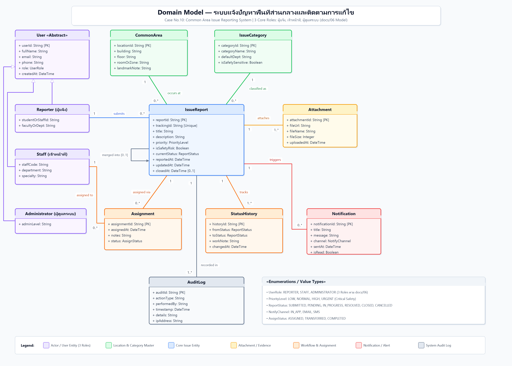

# Domain Models — ระบบแจ้งปัญหาพื้นที่ส่วนกลางและติดตามการแก้ไข

Conceptual Domain Model สำหรับโครงงาน Case No.10 เพื่ออธิบายโครงสร้างข้อมูลเชิงมโนทัศน์ เอนทิตี ความสัมพันธ์ และกฎความสัมพันธ์ของระบบ ก่อนลงรายละเอียดใน Class Diagram และ ERD

> **Source file:** [domain-model.drawio](domain-model.drawio)

---

## 1. คำอธิบายโครงสร้าง Domain Model

### 1.1 หมวดหมู่ผู้ใช้งาน (3 Core Roles อิงตาม docs/06)
- **`User` (Abstract Base Class):** คลาสฐานสำหรับผู้ใช้งานระบบทุกคน ประกอบด้วย `userId`, `fullName`, `email`, `phone`, `role`, `createdAt`
- **`Reporter` (ผู้แจ้ง):** นักศึกษา / อาจารย์ / บุคลากร ผู้พบปัญหาและส่งคำร้องเข้าระบบ เก็บข้อมูลรหัสประจำตัว (`studentOrStaffId`) และคณะ/หน่วยงาน (`facultyOrDept`)
- **`Staff` (เจ้าหน้าที่):** เจ้าหน้าที่อาคาร / ช่างเทคนิค / แม่บ้าน ผู้รับเรื่อง ดำเนินการ ตรวจสอบเหตุเสี่ยงด้านความปลอดภัย และอัปเดตผลการทำงาน เก็บ `staffCode`, `department`, `specialty`
- **`Administrator` (ผู้ดูแลระบบ):** ผู้ดูแลระบบ กำหนดสิทธิ์การเข้าถึง (RBAC), ตรวจสอบ Audit Log, และดูรายงานภาพรวม เก็บ `adminLevel`

### 1.2 เอนทิตีหลักในการแจ้งปัญหา (Core Reporting Entities)
- **`IssueReport` (คำร้องแจ้งปัญหา):** เอนทิตีศูนย์กลาง มี `reportId`, `trackingId` (หมายเลขอ้างอิงติดตามงานที่ไม่ซ้ำกัน), `title`, `description`, `priority` (ระดับความเร่งด่วน), `isSafetyRisk` (ธงแจ้งเหตุเสี่ยงความปลอดภัย), `currentStatus` (สถานะคำร้อง), `reportedAt`, `updatedAt`, `closedAt`
- **`CommonArea` (สถานที่เกิดเหตุ):** ระบุอาคาร (`building`), ชั้น (`floor`), โซนหรือห้อง (`roomOrZone`), และจุดสังเกต (`landmarkNote`)
- **`IssueCategory` (หมวดหมู่ของปัญหา):** ระบุชื่อประเภทปัญหา (`categoryName`), หน่วยงานเริ่มต้นที่รับผิดชอบ (`defaultDept`), และการตั้งค่าว่าเป็นหมวดที่มีความเสี่ยงความปลอดภัยหรือไม่ (`isSafetySensitive`)
- **`Attachment` (รูปภาพหลักฐาน):** ไฟล์แนบประกอบการแจ้งปัญหา มี `fileUrl`, `fileName`, `fileSize`, `uploadedAt` (ระบบกำหนดให้อย่างน้อย 1 รูป)

### 1.3 เอนทิตีสนับสนุนการทำงานและประวัติ (Operations & Tracking)
- **`Assignment` (การมอบหมายงาน):** บันทึกการมอบหมายงานให้เจ้าหน้าที่ พร้อมวันเวลา บันทึกมอบหมาย และสถานะการมอบหมาย
- **`StatusHistory` (ประวัติสถานะและบันทึกผลงาน):** บันทึกการเปลี่ยนผ่านสถานะ (`fromStatus` → `toStatus`), วันเวลาที่เปลี่ยน, และ `workNote` บันทึกผลการปฏิบัติงานของเจ้าหน้าที่
- **`Notification` (การแจ้งเตือน):** การแจ้งเตือนสถานะหรือเหตุฉุกเฉินความปลอดภัยไปยังผู้ใช้ผ่านช่องทางต่างๆ (`In_App`, `Email`, `SMS`)
- **`AuditLog` (ประวัติการใช้งานระดับระบบ):** บันทึกการกระทำสำคัญ (`actionType`, `performedBy`, `timestamp`, `details`, `ipAddress`) โดยไม่สามารถแก้ไขหรือลบได้

---

## 2. Checklist

- [x] มี source file ที่แก้ไขได้ (`domain-model.drawio`)
- [x] มี PNG/PDF export สำหรับใช้ในเอกสาร (`domain-model.png`)
- [x] ชื่อไฟล์สื่อถึง purpose (`domain-model.drawio`, `domain-model.png`)
- [x] เชื่อมโยงกับ requirement/design document (เชื่อมกับ `docs/06`, `docs/07-srs-v1.md`)

