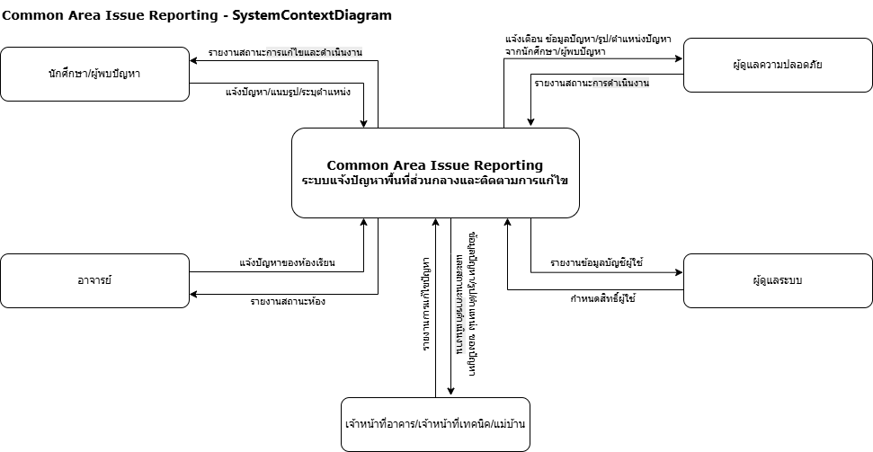

# Week 02 — Stakeholder, Context and Scope

> **Team:** Team Example — Common area issue reporting  
> **Case:** ระบบแจ้งปัญหาพื้นที่ส่วนกลางและติดตามการแก้ไข  
> **Version:** v0.1 (Teaching Example)  
> **Last updated:** 2026-07-11  
> **Diagram source of truth:** Draw.io files in `diagrams/`

---

## 1. Problem Frame (revised)

### 1.1 สถานการณ์ปัจจุบัน

นักศึกษาพบปัญหาในพื้นที่ส่วนกลาง เช่น ห้องน้ำไม่สะอาด ไฟส่องสว่างชำรุด ปลั๊กไฟเสีย พื้นลื่น ถังขยะเต็ม หรือสัญญาณ Wi-Fi มีปัญหา แต่ไม่แน่ใจต้องแจ้งใคร ข้อมูลจึงกระจัดกระจายและมักไม่มีผู้ติดตามว่าเรื่องถูกแก้แล้วหรือยัง

### 1.2 ใครได้รับผลกระทบ

- **นักศึกษา / ผู้พบปัญหา:** ไม่รู้ต้องแจ้งใคร แจ้งแล้วไม่รู้ว่ามีคนรับเรื่องหรือยัง ปัญหาแก้ช้า และต้องแจ้งซ้ำ
- **เจ้าหน้าที่อาคาร / เจ้าหน้าที่เทคนิค / แม่บ้าน:** ได้ข้อมูลไม่ครบ ต้องโทรสอบถามเพิ่ม มีการแจ้งซ้ำหลายครั้ง งานตกหล่น และติดตามงานยาก
- **อาจารย์ :** หากปัญหาไม่ได้รับการแก้ไข อาจส่งผลต่อการเรียนการสอน เช่น ห้องเรียนใช้งานไม่ได้ หรืออุปกรณ์เสีย
- **ผู้ดูแลความปลอดภัย:** กังวลว่าเหตุอันตราย เช่น พื้นลื่น ไฟดับ หรือสายไฟชำรุด จะได้รับการแจ้งช้าและเกิดอุบัติเหตุ- **ผู้ดูแลระบบ:** กังวลเรื่องข้อมูลสูญหาย ผู้ใช้เข้าถึงข้อมูลเกินสิทธิ์ ระบบล่ม หรือข้อมูลส่วนบุคคลรั่วไหล

### 1.3 Problem Statement

> กระบวนการจองพื้นที่ทำงานกลุ่มและอุปกรณ์การเรียนรู้ยังไม่มีข้อมูลสถานะที่รวมศูนย์และตรวจสอบได้ ทำให้เกิดการจองชนกัน การสื่อสารล่าช้า ภาระงานเจ้าหน้าที่สูง และผู้ใช้ไม่ทราบกฎหรือสถานะคำขออย่างชัดเจน

### 1.4 ผลลัพธ์ที่ต้องการ (โดยยังไม่กำหนด solution)

- ผู้แจ้งสามารถแจ้งปัญหาและติดตามสถานะการดำเนินงานได้อย่างชัดเจน
- เจ้าหน้าที่ได้รับข้อมูลที่ครบถ้วนเพียงพอสำหรับการดำเนินการ
- ลดการแจ้งปัญหาซ้ำและลดการสื่อสารหลายช่องทาง
- เพิ่มความรวดเร็วในการรับเรื่องและติดตามการแก้ไข
-ผู้ดูแลสามารถบริหารจัดการงานและจัดลำดับความสำคัญของปัญหาได้อย่างมีประสิทธิภาพ

### 1.5 สิ่งที่ทีมยังต้องเรียนรู้

- ปัญหาแต่ละประเภทเป็นหน้าที่ของหน่วยงานใด
- สถานะของคำร้องควรมีกี่ขั้นตอน
- นักศึกษาหรือผู้พบปัญหาต้องการติดตามสถานะในรูปแบบใด
- ระยะเวลาในการรับเรื่องและแก้ไขของแต่ละประเภทปัญหาควรเป็นเท่าใด

---

## 2. Stakeholder Inventory and Map

> **Source:** [`w02-stakeholder-map.drawio`]

| Stakeholder / External System | Role / Current work | Goal / Need | Influence | Interest | Why it matters |
|---|---|---|---|---|---|
| นักศึกษา / ผู้พบปัญหา | แจ้งปัญหา แนบรายละเอียด และติดตามสถานะการดำเนินงาน                                          | แจ้งปัญหาได้ง่าย ติดตามความคืบหน้า และได้รับการแก้ไขอย่างรวดเร็ว | Medium  | High  | เป็นผู้ใช้หลักและเป็นผู้เริ่มต้นกระบวนการแจ้งปัญหา  |
| เจ้าหน้าที่อาคาร / เจ้าหน้าที่เทคนิค / แม่บ้าน | รับเรื่อง ตรวจสอบ แก้ไข หรือส่งต่อปัญหา และอัปเดตสถานะการดำเนินงาน | ได้รับข้อมูลครบถ้วน จัดลำดับงานได้ง่าย และติดตามงานที่รับผิดชอบได้  | High | High  | เป็นผู้ปฏิบัติงานหลักและมีความรู้เกี่ยวกับขั้นตอนการแก้ไขปัญหาจริง |
| อาจารย์  | แจ้งปัญหาที่ส่งผลกระทบต่อการเรียนการสอน และติดตามสถานะการแก้ไข | ปัญหาได้รับการแก้ไขอย่างรวดเร็วเพื่อลดผลกระทบต่อการเรียนการสอน  | Low  | Medium   | เป็นผู้ใช้งานที่ได้รับผลกระทบจากสภาพพื้นที่และอุปกรณ์การเรียน   |
| ผู้ดูแลความปลอดภัย  | รับแจ้งเหตุที่เกี่ยวข้องกับความปลอดภัย ประเมินความเร่งด่วน และประสานงานเมื่อเกิดเหตุอันตราย | ได้รับแจ้งเหตุที่มีความเสี่ยงอย่างรวดเร็วและสามารถดำเนินการได้ทันเวลา | High | High  | รับผิดชอบเหตุที่อาจก่อให้เกิดอุบัติเหตุหรือความเสียหายต่อผู้ใช้งาน |
| ผู้ดูแลระบบ  | ดูแลบัญชีผู้ใช้ สิทธิ์การเข้าถึง ความปลอดภัยของข้อมูล และการทำงานของระบบ | ระบบมีความปลอดภัย ข้อมูลถูกต้อง และผู้ใช้เข้าถึงข้อมูลตามสิทธิ์  | High | Medium | รับผิดชอบการดูแลระบบและกำหนดข้อจำกัดด้านเทคนิคและความปลอดภัย  |

### 2.1 Stakeholder Profiles

#### Stakeholder: นักศึกษา / ผู้พบปัญหา

- **Goal / need:** แจ้งปัญหาได้ง่าย แนบรูปภาพ ระบุตำแหน่ง ติดตามสถานะ และได้รับการแจ้งเตือนเมื่อมีการอัปเดต
- **Pain point:** ไม่รู้ต้องแจ้งใคร แจ้งแล้วไม่รู้ว่ามีคนรับเรื่องหรือยัง ต้องแจ้งซ้ำ และติดตามความคืบหน้าได้ยาก
- **Concern / risk:** กังวลว่าปัญหาจะไม่ได้รับการแก้ไขหรือได้รับการแก้ไขล่าช้า ส่งผลกระทบต่อการใช้งานพื้นที่ส่วนกลาง
- **Information this stakeholder knows:** รายละเอียดของปัญหา สถานที่เกิดเหตุ ช่วงเวลาที่พบปัญหา และผลกระทบที่เกิดขึ้น
- **Influence / decision power:** Medium — เป็นผู้แจ้งปัญหา แต่ไม่มีอำนาจกำหนดแนวทางการแก้ไข
- **Open questions for Week 3:** ผู้ใช้ต้องการแนบข้อมูลอะไรบ้าง? ต้องการติดตามสถานะในรูปแบบใด? ต้องการรับการแจ้งเตือนผ่านช่องทางใด?

#### Stakeholder: เจ้าหน้าที่อาคาร / เจ้าหน้าที่เทคนิค / แม่บ้าน

- **Goal / need:** รับข้อมูลปัญหาที่ครบถ้วน จัดลำดับงาน มอบหมายงาน แก้ไขปัญหา และอัปเดตสถานะได้สะดวก
- **Pain point:** ได้รับข้อมูลไม่ครบ ต้องสอบถามเพิ่มเติม มีการแจ้งปัญหาซ้ำ และติดตามงานหลายช่องทาง
- **Concern / risk:** งานตกหล่น การแก้ไขล่าช้า หรือส่งงานผิดหน่วยงาน ทำให้ผู้แจ้งไม่พึงพอใจ
- **Information this stakeholder knows:** ขั้นตอนการรับเรื่อง วิธีการแก้ไข ผู้รับผิดชอบแต่ละประเภทของปัญหา และระยะเวลาการดำเนินงาน
- **Influence / decision power:** High — เป็นผู้รับผิดชอบดำเนินการและอัปเดตสถานะของงาน
- **Open questions for Week 3:** ปัญหาแต่ละประเภทควรส่งให้หน่วยงานใด? ควรแบ่งลำดับความสำคัญของงานอย่างไร? สถานะของงานควรมีกี่ขั้นตอน?

#### Stakeholder: อาจารย์

- **Goal / need:** แจ้งปัญหาที่ส่งผลต่อการเรียนการสอน และติดตามความคืบหน้าของการแก้ไข
- **Pain point:** เมื่อปัญหาไม่ได้รับการแก้ไข อาจส่งผลให้ห้องเรียนหรืออุปกรณ์ไม่พร้อมใช้งาน
- **Concern / risk:** การเรียนการสอนและกิจกรรมของนักศึกษาได้รับผลกระทบจากปัญหาที่ไม่ได้รับการแก้ไข
- **Information this stakeholder knows:** ผลกระทบของปัญหาต่อการเรียนการสอน ช่วงเวลาที่ใช้งานห้องเรียน และความเร่งด่วนของปัญหาาม
- **Influence / decision power:** Low — สามารถแจ้งปัญหาและให้ข้อมูลเพิ่มเติม แต่ไม่ได้ตัดสินใจการดำเนินงาน
- **Open questions for Week 3:** ปัญหาใดควรได้รับการแก้ไขเป็นลำดับแรก? อาจารย์ต้องการรับการแจ้งเตือนเมื่อใด?

#### Stakeholder: ผู้ดูแลความปลอดภัย

- **Goal / need:** รับแจ้งเหตุที่มีความเสี่ยงด้านความปลอดภัยอย่างรวดเร็ว พร้อมทราบตำแหน่งที่เกิดเหตุอย่างชัดเจน
- **Pain point:** การได้รับแจ้งเหตุล่าช้าหรือข้อมูลไม่ครบ ทำให้ตอบสนองต่อเหตุการณ์ได้ไม่ทันเวลา
- **Concern / risk:** อาจเกิดอุบัติเหตุหรือความเสียหายต่อผู้ใช้งาน หากไม่ได้รับแจ้งเหตุอย่างทันท่วงที
- **Information this stakeholder knows:** อาจเกิดอุบัติเหตุหรือความเสียหายต่อผู้ใช้งาน หากไม่ได้รับแจ้งเหตุอย่างทันท่วงที
- **Influence / decision power:** High — สามารถกำหนดลำดับความเร่งด่วนและประสานงานเมื่อเกิดเหตุด้านความปลอดภัย
- **Open questions for Week 3:** ปัญหาประเภทใดควรจัดเป็นเหตุเร่งด่วน? ควรมีการแจ้งเตือนแบบใดเมื่อเกิดเหตุฉุกเฉิน?

#### Stakeholder: ผู้ดูแลระบบ

- **Goal / need:** ดูแลบัญชีผู้ใช้ สิทธิ์การเข้าถึง สำรองข้อมูล และรักษาความปลอดภัยของระบบพร้อมทราบตำแหน่งที่เกิดเหตุอย่างชัดเจน
- **Pain point:** ระบบอาจมีการกำหนดสิทธิ์ไม่เหมาะสม ข้อมูลสูญหาย หรือเกิดปัญหาด้านความปลอดภัย
- **Concern / risk:** ข้อมูลส่วนบุคคลรั่วไหล ผู้ใช้เข้าถึงข้อมูลเกินสิทธิ์ หรือระบบไม่สามารถให้บริการได้
- **Information this stakeholder knows:** การจัดการบัญชีผู้ใช้ สิทธิ์การเข้าถึง การสำรองข้อมูล และมาตรฐานด้านความปลอดภัยของระบบ
- **Influence / decision power:** High — กำหนดข้อจำกัดด้านเทคนิค ความปลอดภัย และสิทธิ์การเข้าถึงข้อมูล
- **Open questions for Week 3:** ผู้ใช้แต่ละบทบาทควรเข้าถึงข้อมูลใดได้บ้าง? ระบบควรเก็บข้อมูลอะไรบ้าง? ควรมีนโยบายการสำรองข้อมูลและการตรวจสอบประวัติการใช้งานอย่างไร?
---

## 3. System Context

> **Source:** [`w02-system-context.drawio`](../diagrams/context/SystemContextDiagram.drawio)

### 3.1 System Boundary

ขอบเขตของ **Common Area Issue Reporting System** ครอบคลุมการแจ้งปัญหาในพื้นที่ส่วนกลาง การระบุรายละเอียดและตำแหน่งของปัญหา การรับเรื่อง การมอบหมายผู้รับผิดชอบ การอัปเดตสถานะ การติดตามความคืบหน้า และการแจ้งเตือนผู้เกี่ยวข้อง ระบบ **ไม่ใช่** ระบบซ่อมบำรุงเชิงลึก ระบบจัดซื้อวัสดุหรืออุปกรณ์ระบบควบคุมการเข้า–ออกอาคารหรือระบบแจ้งเหตุฉุกเฉินที่ต้องประสานงานกับหน่วยงานภายนอก

### 3.2 Key Data Flows

| From → To | Data / Request | Why it matters |
|---|---|---|
| นักศึกษา / ผู้พบปัญหา → ระบบ | รายละเอียดปัญหา รูปภาพ ตำแหน่ง และข้อมูลการแจ้ง          | เป็นจุดเริ่มต้นของกระบวนการรับแจ้งปัญหา |
| ระบบ → นักศึกษา / ผู้พบปัญหา | เลขที่คำร้อง สถานะ ความคืบหน้า และการแจ้งเตือน           | ช่วยให้ผู้แจ้งติดตามผลได้และลดการสอบถามซ้ำ |
| เจ้าหน้าที่อาคาร / เจ้าหน้าที่เทคนิค / แม่บ้าน → ระบบ | รับเรื่อง มอบหมายงาน อัปเดตสถานะ และบันทึกผลการดำเนินงาน | แสดงขั้นตอนการดำเนินงานจริงของผู้รับผิดชอบ                 |
| ระบบ → เจ้าหน้าที่อาคาร / เจ้าหน้าที่เทคนิค / แม่บ้าน | รายการคำร้อง รายละเอียดปัญหา และลำดับความสำคัญของงาน  | ช่วยให้เจ้าหน้าที่จัดการและติดตามงานได้อย่างมีประสิทธิภาพ  |
| ผู้ดูแลระบบ ↔ ระบบ | จัดการบัญชีผู้ใช้ สิทธิ์การเข้าถึง และข้อมูลระบบ| สนับสนุนการบริหารจัดการระบบและรักษาความปลอดภัยของข้อมูล |
| ระบบ ↔ University Identity Service | คำขอตรวจสอบบัญชีผู้ใช้และบทบาท                           | รองรับการยืนยันตัวตนและกำหนดสิทธิ์การใช้งาน |
| ระบบ → Notification Service | ข้อมูลการแจ้งเตือนเมื่อสถานะคำร้องเปลี่ยนแปลง            | ทำให้ผู้แจ้งและเจ้าหน้าที่ได้รับข้อมูลที่ถูกต้องและทันเวลา |

---

## 4. Scope Statement

### In Scope

1. ผู้ใช้สามารถแจ้งปัญหาในพื้นที่ส่วนกลาง พร้อมระบุรายละเอียด แนบรูปภาพ และระบุตำแหน่งของปัญหาได้
2. ผู้ใช้สามารถติดตามสถานะคำร้องและได้รับการแจ้งเตือนเมื่อมีการอัปเดตสถานะ
3. เจ้าหน้าที่สามารถรับเรื่อง มอบหมายงาน อัปเดตสถานะ และบันทึกผลการดำเนินงานได้
4. ผู้ดูแลความปลอดภัยสามารถรับแจ้งเหตุที่มีความเร่งด่วนและติดตามการดำเนินการได้
5. ผู้ดูแลระบบสามารถจัดการบัญชีผู้ใช้ สิทธิ์การเข้าถึง และดูแลข้อมูลของระบบได้

### Out of Scope

1. ระบบซ่อมบำรุงเชิงลึกและการบริหารครุภัณฑ์
2. ระบบจัดซื้อวัสดุหรืออุปกรณ์
3. การแจ้งเหตุฉุกเฉินที่ต้องประสานงานกับหน่วยงานภายนอก 
4. ระบบบริหารงบประมาณหรือจัดซื้อเพื่อการซ่อมบำรุง

### Constraints

- เป็นโครงงานเพื่อการเรียนรู้ภายใน 1 ภาคการศึกษา
- ไม่ใช้ข้อมูลส่วนบุคคลจริงหรือเชื่อมต่อระบบมหาวิทยาลัยจริงในระยะเรียน
- ข้อมูลทะเบียนทรัพยากรเดิมอาจไม่ครบหรือมีรูปแบบไม่มาตรฐาน
- ทีมมีสมาชิก 2-3 คน และเวลาพัฒนา/ออกแบบจำกัด

### Assumptions

- ผู้ใช้สามารถใช้งานระบบผ่านสมาร์ตโฟนหรือเว็บไซต์และมีอินเทอร์เน็ต
- ผู้แจ้งสามารถแนบรูปภาพและระบุตำแหน่งของปัญหาได้
- เจ้าหน้าที่สามารถรับเรื่อง อัปเดตสถานะ และบันทึกผลการดำเนินงานได้
- แต่ละประเภทของปัญหามีหน่วยงานหรือผู้รับผิดชอบที่ชัดเจน

### Open Questions

| ID | Open Question | Why it matters | Priority | ส่งต่อ Week 03 อย่างไร |
|---|---|---|---|---|
| OQ-01 | ปัญหาแต่ละประเภทเป็นหน้าที่ของหน่วยงานใด?                          | ใช้กำหนดผู้รับผิดชอบและขั้นตอนการส่งต่อคำร้อง | High| สัมภาษณ์เจ้าหน้าที่อาคารและเจ้าหน้าที่เทคนิค |
| OQ-02 | สถานะของคำร้องควรมีกี่ขั้นตอน และแต่ละขั้นตอนหมายถึงอะไร? | ใช้ออกแบบ Workflow และการติดตามสถานะ | High  | สัมภาษณ์เจ้าหน้าที่และวิเคราะห์ขั้นตอนการทำงาน |
| OQ-03 | ปัญหาประเภทใดควรจัดเป็นเหตุเร่งด่วน และใครเป็นผู้รับผิดชอบ? | ใช้กำหนดลำดับความสำคัญและการแจ้งเตือน | High | สัมภาษณ์ผู้ดูแลความปลอดภัยและเจ้าหน้าที่อาคาร |
| OQ-04 | ผู้แจ้งต้องระบุข้อมูลอะไรบ้างเพื่อให้เจ้าหน้าที่ดำเนินการได้ทันที? | ใช้ออกแบบข้อมูลในแบบฟอร์มแจ้งปัญหา | Medium | สัมภาษณ์เจ้าหน้าที่และทดลองกรอกแบบฟอร์ม  |
| OQ-05 | ผู้ใช้ต้องการรับการแจ้งเตือนผ่านช่องทางใด และเมื่อใด? | ส่งผลต่อการออกแบบการแจ้งเตือนและประสบการณ์ผู้ใช้ | Medium | สัมภาษณ์นักศึกษาและอาจารย์                     |

---

## 5. Privacy, Ethics, Security and Responsible AI

| ประเด็น | การตัดสินใจ/ข้อควรระวังใน Case นี้ |
|---|---|
| Data minimization | เก็บเฉพาะข้อมูลที่จำเป็น เช่น รหัสผู้ใช้ บทบาท รายละเอียดปัญหา รูปภาพ ตำแหน่งที่เกิดเหตุ และสถานะคำร้อง โดยไม่เก็บข้อมูลส่วนบุคคลที่ไม่เกี่ยวข้อง   |
| Role-based access | ผู้แจ้งเห็นเฉพาะคำร้องของตน เจ้าหน้าที่เห็นเฉพาะคำร้องที่รับผิดชอบ ผู้ดูแลระบบสามารถจัดการผู้ใช้และสิทธิ์การเข้าถึงข้อมูลตามบทบาท  |
| Transparency | ผู้แจ้งควรสามารถตรวจสอบสถานะของคำร้อง เห็นความคืบหน้าการดำเนินงาน และทราบเหตุผลเมื่อคำร้องถูกปิดหรือไม่สามารถดำเนินการได้  |
| Fairness | การจัดลำดับความสำคัญของปัญหาและการมอบหมายงานควรใช้หลักเกณฑ์เดียวกันกับทุกคำร้อง และสามารถอธิบายเหตุผลของการตัดสินใจได้ |
| Responsible AI | AI อาจช่วยสรุปข้อมูล จัดหมวดหมู่ปัญหา หรือช่วยตรวจสอบความถูกต้องของเอกสารได้ แต่ห้ามสร้างข้อมูลหรือข้อเท็จจริงแทนผู้มีส่วนได้ส่วนเสีย และทุกข้อมูลต้องผ่านการตรวจสอบจากทีมและอ้างอิงตามความต้องการของลูกค้า (Problem Brief) ก่อนนำไปใช้งาน |

---

## 6. Tabletop Studio Feedback Action

### Feedback received

- **Reviewer Team:** แนะนำให้แยกบทบาทของ เจ้าหน้าที่อาคาร / เจ้าหน้าที่เทคนิค / แม่บ้าน ออกจาก ผู้ดูแลความปลอดภัย เนื่องจากมีหน้าที่และความรับผิดชอบแตกต่างกัน
- **Reviewer Team:** เสนอให้กำหนดคำถามเกี่ยวกับการจัดลำดับความสำคัญของปัญหาและการส่งต่อหน่วยงานรับผิดชอบไว้ใน Open Questions
- **Instructor cue:** ระบบควรมุ่งเน้นเฉพาะการแจ้งปัญหาและติดตามการแก้ไข ไม่ควรครอบคลุมระบบซ่อมบำรุงเชิงลึก ระบบจัดซื้อ หรือระบบบริหารครุภัณฑ์ เพราะจะทำให้ขอบเขตโครงงานกว้างเกินไป

### What the team changed

1. ปรับ Stakeholder ให้สอดคล้องกับผู้มีส่วนเกี่ยวข้องในกรณีศึกษา ได้แก่ นักศึกษา เจ้าหน้าที่อาคาร/เจ้าหน้าที่เทคนิค/แม่บ้าน อาจารย์ ผู้ดูแลความปลอดภัย และผู้ดูแลระบบ
2. เพิ่ม Open Questions เกี่ยวกับการจัดลำดับความสำคัญของปัญหา ขั้นตอนการดำเนินงาน และผู้รับผิดชอบของแต่ละประเภทปัญหา
3. ปรับ Scope โดยย้ายระบบซ่อมบำรุงเชิงลึก ระบบจัดซื้อ และระบบควบคุมการเข้า–ออกอาคารไปไว้ใน Out of Scope

### What remains uncertain for Week 3

- แต่ละประเภทของปัญหาควรส่งต่อให้หน่วยงานใดรับผิดชอบ
- สถานะของคำร้องควรมีกี่ขั้นตอน และแต่ละขั้นตอนมีความหมายอย่างไร
- เกณฑ์การจัดลำดับความสำคัญของปัญหาและเหตุเร่งด่วน
- ช่องทางและช่วงเวลาที่เหมาะสมสำหรับการแจ้งเตือนผู้ใช้งาน